# Maelstrom V0 — 需求分析与可行性分析

> **版本**: 0.1.0-draft
> **日期**: 2026-03-15
> **范围**: V0 MVP — Gap Engine + QA Chat
> **技术栈**: Next.js + shadcn/ui · FastAPI · LangGraph · paper-qa · SQLite

---

## 目录

1. [V0 范围定义](#1-v0-范围定义)
2. [V0 系统架构](#2-v0-系统架构)
3. [论文检索层设计](#3-论文检索层设计)
4. [paper-qa 集成分析](#4-paper-qa-集成分析)
5. [LangGraph 工作流设计](#5-langgraph-工作流设计)
6. [FastAPI 后端设计](#6-fastapi-后端设计)
7. [Next.js 前端设计](#7-nextjs-前端设计)
8. [QA Chat 设计](#8-qa-chat-设计)
9. [Artifact Schemas](#9-artifact-schemas)
10. [各组件可行性分析](#10-各组件可行性分析)
11. [风险分析与缓解](#11-风险分析与缓解)
12. [实施阶段](#12-实施阶段)
13. [技术依赖分析](#13-技术依赖分析)

---

## 1. V0 范围定义

### 1.1 In-Scope

| 模块 | V0 交付内容 |
|------|------------|
| Gap Engine | 完整的 Topic Intake → Query Expansion → Paper Retrieval → Normalize/Dedup → Coverage Matrix → Gap Hypothesis → Gap Critic → Ranking 流水线 |
| QA Chat | 基于 paper-qa 的论文问答，支持上传 PDF 与检索论文，返回带引用的回答 |
| 论文检索 | arXiv + OpenReview + Semantic Scholar + OpenAlex 四源并行检索，统一 `PaperRecord` 格式 |
| 前端 | Next.js + shadcn/ui：Gap Engine 操作页、QA Chat 页、LLM 配置页 |
| 后端 | FastAPI：会话管理、LLM 配置透传、流式响应、Artifact CRUD |
| 存储 | SQLite 存储会话/Artifact 元数据，本地文件存储 PDF/内容 |
| LLM 配置 | 前端配置页，内存态存储（关闭即清除），支持 OpenAI / Anthropic / 本地模型 |

### 1.2 Out-of-Scope (V1+)

- Synthesis Engine / Planning Engine / Experiment Engine
- MCP Gateway 与 Skills Registry
- Evidence Graph 持久化
- 多用户 / 认证 / 权限
- MLflow / W&B 集成
- OpenTelemetry 全链路追踪
- 生产级部署（Docker / K8s）
- Policy / Approval Console（V0 使用简化的内联确认）

### 1.3 成功标准

| 指标 | 目标 |
|------|------|
| Gap Engine 端到端完成率 | 给定主题 → 输出 ranked GapItem[] ≥ 90% 成功率 |
| QA Chat 引用准确率 | 回答中引用可追溯到原文 ≥ 80% |
| 检索覆盖率 | 四源中至少 3 源正常返回结果 |
| 首次响应延迟 | QA Chat 流式首 token ≤ 3s |
| 前端可用性 | 核心流程无阻塞性 bug，shadcn/ui 组件一致 |

---

## 2. V0 系统架构

### 2.1 从 5 层裁剪到 3 层

完整 Maelstrom 架构为 5 层（L1-L5），V0 裁剪为 3 层：

| V0 层 | 对应完整架构 | V0 实现 |
|--------|-------------|---------|
| **表现层** | L5 Workspace & Governance | Next.js + shadcn/ui（Gap Engine 页 + QA Chat 页 + LLM 配置页） |
| **服务层** | L4 Research Engines + L3 Orchestration Runtime | FastAPI + LangGraph（Gap Engine 工作流 + QA Chat 子图） |
| **数据层** | L1 Data Foundation | SQLite + 本地文件 + paper-qa 内置索引 |

裁剪掉的层：
- **L2 Agent-Native Primitives** → V0 不引入独立 Agent Runtime / Memory Substrate / Skills Registry / MCP Gateway，agent 逻辑内联到 LangGraph 节点
- **L3 部分组件** → Phase Router / DAG Template Selector / Budget Controller / Interrupt Manager 简化为 LangGraph 内置路由与手动检查点

### 2.2 架构图

```mermaid
graph TB
    subgraph 表现层["表现层 — Next.js + shadcn/ui"]
        FE_GAP["Gap Engine 页面"]
        FE_QA["QA Chat 页面"]
        FE_CFG["LLM 配置页"]
    end

    subgraph 服务层["服务层 — FastAPI + LangGraph"]
        API["FastAPI Server"]
        subgraph LG["LangGraph Runtime"]
            GE["Gap Engine 工作流"]
            QA["QA Chat 子图"]
        end
        PQA["paper-qa"]
        PR["PaperRetriever（四源）"]
    end

    subgraph 数据层["数据层"]
        DB["SQLite"]
        FS["本地文件系统（PDF/内容）"]
        IDX["paper-qa 向量索引"]
    end

    FE_GAP -->|REST + SSE| API
    FE_QA -->|REST + SSE| API
    FE_CFG -->|REST| API
    API --> GE
    API --> QA
    GE --> PR
    GE --> PQA
    QA --> PQA
    PR -->|HTTP| EXT["arXiv / OpenReview / S2 / OpenAlex"]
    PQA --> IDX
    GE --> DB
    QA --> DB
    PQA --> FS
    GE --> FS
```

### 2.3 通信模型

| 通信路径 | 协议 | 说明 |
|----------|------|------|
| 前端 → 后端 | REST (JSON) | 常规请求：会话管理、Artifact CRUD、LLM 配置 |
| 前端 ← 后端（流式） | SSE (Server-Sent Events) | Gap Engine 进度推送、QA Chat 流式回答 |
| 后端 → 论文源 | HTTPS | 四源 API 并行调用 |
| 后端 → paper-qa | Python 进程内调用 | 直接 import，无 RPC 开销 |
| 后端 → SQLite | 文件 I/O | aiosqlite 异步访问 |

---

## 3. 论文检索层设计

### 3.1 PaperRetriever 统一类

```python
class PaperRetriever:
    """统一论文检索入口，并行调用四源适配器，归一化 + 去重后返回 PaperRecord[]"""

    adapters: list[BaseAdapter]  # [ArxivAdapter, OpenReviewAdapter, S2Adapter, OpenAlexAdapter]

    async def search(self, query: str, max_results: int = 50) -> list[PaperRecord]:
        """并行调用所有适配器，合并 → 归一化 → 去重 → 排序"""
        ...

    async def search_with_fallback(self, query: str, max_results: int = 50) -> SearchResult:
        """带降级策略的检索，返回结果 + 各源状态"""
        ...
```

### 3.2 四源适配器

| 适配器 | API | 特点 | 速率限制 |
|--------|-----|------|----------|
| `ArxivAdapter` | arxiv.org REST API | 预印本为主，无需 API key，XML 响应 | 3 req/s（礼貌限制） |
| `OpenReviewAdapter` | OpenReview API v2 | 顶会论文（ICLR/NeurIPS/ICML），JSON 响应 | 需注意分页，无官方限制文档 |
| `SemanticScholarAdapter` | Semantic Scholar API | 覆盖面广，引用网络，支持 batch | 100 req/5min（无 key）/ 更高（有 key） |
| `OpenAlexAdapter` | OpenAlex REST API | 开放元数据，覆盖 2.5 亿+ 作品，无需 key | 10 req/s（polite pool 需 mailto） |

每个适配器实现 `BaseAdapter` 接口：

```python
class BaseAdapter(ABC):
    source_name: str

    @abstractmethod
    async def search(self, query: str, max_results: int) -> list[RawPaperResult]:
        ...

    @abstractmethod
    def normalize(self, raw: RawPaperResult) -> PaperRecord:
        ...
```

### 3.3 归一化

所有适配器返回的原始结果统一转换为 `PaperRecord`（见第 9 章 Schema 定义）。归一化规则：

- **标题**: strip HTML 标签，统一 Unicode 规范化 (NFC)
- **作者**: 统一为 `[{name: str, affiliation: str | None}]` 格式
- **日期**: 统一为 ISO 8601 (`YYYY-MM-DD`)，缺失时取 API 返回的最早可用日期
- **ID 映射**: 保留各源原始 ID（`arxiv_id`, `s2_id`, `openreview_id`, `openalex_id`），同时生成内部 `paper_id`

### 3.4 去重策略

按优先级依次匹配：

1. **DOI 精确匹配** — 最可靠
2. **Semantic Scholar ID / Corpus ID 匹配** — S2 已做跨源去重
3. **标题模糊匹配** — Levenshtein 相似度 ≥ 0.92 且作者首作者姓氏一致
4. 合并时保留元数据最丰富的记录，其余源 ID 合并到 `external_ids` 字段

### 3.5 降级策略

```
四源全部成功 → 正常返回
某源超时/错误 → 记录 warning，返回其余源结果
仅一源成功   → 返回结果 + 标记 degraded
全部失败     → 返回错误，建议用户检查网络或稍后重试
```

每次检索返回 `SearchResult`，包含各源状态：

```python
@dataclass
class SourceStatus:
    source: str          # "arxiv" | "openreview" | "s2" | "openalex"
    status: str          # "ok" | "timeout" | "error" | "rate_limited"
    count: int           # 返回条数
    latency_ms: float
    error_msg: str | None

@dataclass
class SearchResult:
    papers: list[PaperRecord]
    source_statuses: list[SourceStatus]
    is_degraded: bool
```

---

## 4. paper-qa 集成分析

### 4.1 paper-qa 提供什么

| 能力 | 说明 |
|------|------|
| PDF 解析与分块 | 自动将 PDF 拆分为语义 chunk，提取文本与元数据 |
| 向量索引与检索 | 内置嵌入模型 + 向量存储，支持相似度检索 |
| 问答生成 | 检索相关 chunk → 生成带引用的回答 |
| 引用溯源 | 回答中每个断言绑定到具体 PDF 页码/段落 |
| 多文档支持 | 可同时索引多篇论文，跨文档回答 |

### 4.2 paper-qa 不提供什么

| 缺失能力 | V0 解决方案 |
|----------|------------|
| 论文检索/下载 | 由 `PaperRetriever` 四源检索层负责 |
| 结构化 Gap 分析 | 由 LangGraph Gap Engine 工作流负责 |
| 会话管理 | 由 FastAPI 会话层负责 |
| LLM 多模型切换 | 通过 LLM 配置透传实现 |
| 流式输出控制 | 由 FastAPI SSE 层包装 |
| 持久化存储 | 由 SQLite + 本地文件层负责 |

### 4.3 嵌入 LangGraph 的方式

paper-qa 作为 LangGraph 节点内的工具调用，而非独立子图：

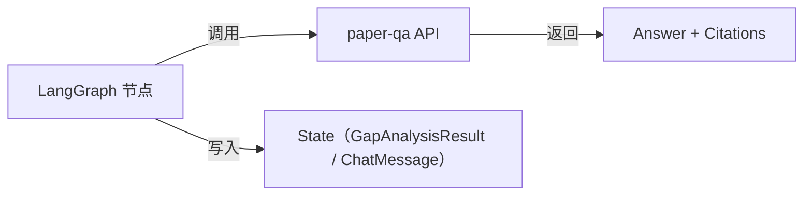

集成模式：

```python
from paperqa import Settings, ask

async def paperqa_node(state: GraphState) -> GraphState:
    """LangGraph 节点：调用 paper-qa 进行文档问答"""
    settings = Settings(
        llm=state["llm_config"]["model_name"],
        llm_config={
            "api_key": state["llm_config"]["api_key"],
            "temperature": state["llm_config"]["temperature"],
        },
        embedding=state["llm_config"].get("embedding_model", "text-embedding-3-small"),
    )
    result = await ask(
        query=state["current_query"],
        docs=state["indexed_docs"],
        settings=settings,
    )
    return {**state, "qa_result": result}
```

### 4.4 LLM 配置透传

用户在前端配置的 LLM 参数通过以下链路透传到 paper-qa：

```
前端 LLM 配置页 → API POST /config/llm → 内存态 LLMConfig
→ LangGraph State 注入 → paper-qa Settings 构造
```

paper-qa 的 `Settings` 对象在每次调用时根据当前 `LLMConfig` 动态构造，不缓存，确保配置变更即时生效。

---

## 5. LangGraph 工作流设计

### 5.1 State Schema

```python
from typing import TypedDict, Literal, Optional
from langgraph.graph import MessagesState

class GapEngineState(TypedDict):
    # 输入
    topic: str
    llm_config: "LLMConfig"
    session_id: str

    # 中间状态
    expanded_queries: list[str]
    raw_papers: list["PaperRecord"]
    papers: list["PaperRecord"]              # 归一化 + 去重后
    coverage_matrix: dict                     # task-method-dataset-metric 矩阵
    gap_hypotheses: list["GapItem"]
    critic_results: list[dict]                # {gap_id, verdict, reasons}

    # 输出
    ranked_gaps: list["GapItem"]
    topic_candidates: list["TopicCandidate"]
    search_result: "SearchResult"             # 检索元信息（各源状态）

    # 控制
    current_step: str
    error: Optional[str]
```

### 5.2 Gap Engine — 8 个节点定义

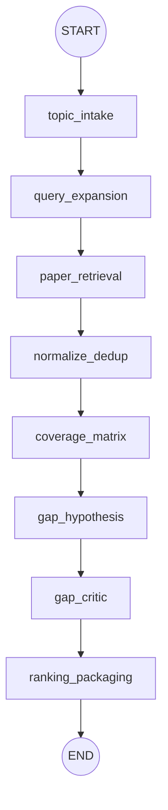

| # | 节点 | 类型 | 输入 | 输出 | 说明 |
|---|------|------|------|------|------|
| 1 | `topic_intake` | deterministic | `topic` | `topic`（校验后） | 校验输入，提取关键词，记录 session |
| 2 | `query_expansion` | agentic (LLM) | `topic` | `expanded_queries[]` | LLM 生成 3-5 个检索变体查询 |
| 3 | `paper_retrieval` | tool | `expanded_queries[]` | `raw_papers[]`, `search_result` | 调用 `PaperRetriever.search_with_fallback` |
| 4 | `normalize_dedup` | deterministic | `raw_papers[]` | `papers[]` | 归一化 + 去重（见第 3 章） |
| 5 | `coverage_matrix` | deterministic | `papers[]` | `coverage_matrix` | 构建 task-method-dataset-metric 覆盖矩阵 |
| 6 | `gap_hypothesis` | agentic (LLM) | `coverage_matrix`, `papers[]` | `gap_hypotheses[]` | LLM 分析覆盖空白，生成 Gap 假设 |
| 7 | `gap_critic` | agentic (LLM) | `gap_hypotheses[]`, `papers[]` | `critic_results[]` | LLM 评审每个 Gap：keep / revise / drop |
| 8 | `ranking_packaging` | deterministic + LLM | `gap_hypotheses[]`, `critic_results[]` | `ranked_gaps[]`, `topic_candidates[]` | 过滤 drop，评分排序，生成 TopicCandidate |

### 5.3 Edge 路由

V0 采用线性流水线，无条件分支。唯一的路由逻辑：

```python
def should_continue_after_retrieval(state: GapEngineState) -> str:
    """检索后路由：有结果则继续，全部失败则终止"""
    if state.get("error") or not state["raw_papers"]:
        return "error_end"
    return "normalize_dedup"
```

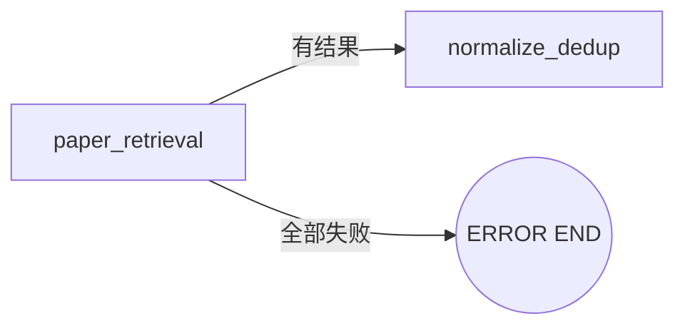

### 5.4 QA Chat 子图

QA Chat 作为独立子图，可被 Gap Engine 调用，也可独立运行：

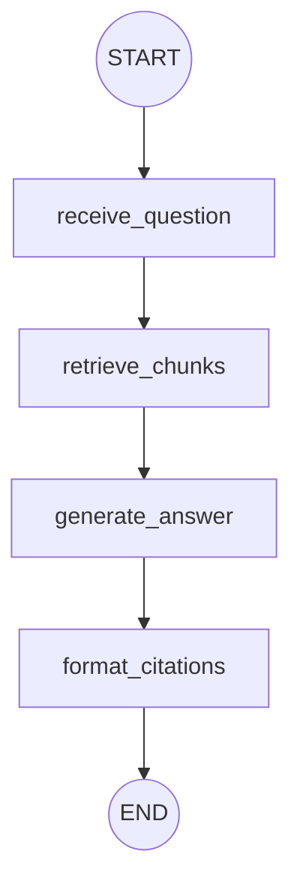

```python
class QAChatState(TypedDict):
    question: str
    llm_config: "LLMConfig"
    session_id: str
    indexed_docs: list[str]       # paper-qa doc 引用
    retrieved_chunks: list[dict]
    answer: str
    citations: list[dict]
    error: Optional[str]
```

### 5.5 Checkpoint 策略

V0 使用 LangGraph 内置的 `SqliteSaver` 作为 checkpointer：

```python
from langgraph.checkpoint.sqlite.aio import AsyncSqliteSaver

checkpointer = AsyncSqliteSaver.from_conn_string("maelstrom_v0.db")
graph = workflow.compile(checkpointer=checkpointer)
```

检查点时机：
- 每个节点完成后自动保存（LangGraph 默认行为）
- 支持从任意节点恢复（用于错误重试）
- V0 不实现 Human-in-the-loop 中断，但 checkpoint 为 V1 HITL 预留基础

---

## 6. FastAPI 后端设计

### 6.1 API Endpoints

#### 会话管理

| Method | Path | 说明 |
|--------|------|------|
| `POST` | `/api/sessions` | 创建新会话 |
| `GET` | `/api/sessions/{session_id}` | 获取会话详情（含状态、artifact 列表） |
| `GET` | `/api/sessions` | 列出所有会话 |
| `DELETE` | `/api/sessions/{session_id}` | 删除会话及关联数据 |

#### Gap Engine

| Method | Path | 说明 |
|--------|------|------|
| `POST` | `/api/gap/run` | 启动 Gap Engine 工作流（传入 topic + session_id） |
| `GET` | `/api/gap/run/{run_id}/status` | 查询运行状态与当前步骤 |
| `GET` | `/api/gap/run/{run_id}/stream` | SSE 流式推送进度与中间结果 |
| `GET` | `/api/gap/run/{run_id}/result` | 获取最终结果（ranked_gaps + topic_candidates） |

#### QA Chat

| Method | Path | 说明 |
|--------|------|------|
| `POST` | `/api/chat/ask` | 提交问题（传入 question + session_id） |
| `GET` | `/api/chat/ask/{msg_id}/stream` | SSE 流式回答 |
| `POST` | `/api/chat/docs/upload` | 上传 PDF 到 paper-qa 索引 |
| `GET` | `/api/chat/docs` | 列出当前会话已索引文档 |

#### Artifact

| Method | Path | 说明 |
|--------|------|------|
| `GET` | `/api/artifacts/{artifact_id}` | 获取单个 Artifact（GapItem / TopicCandidate 等） |
| `GET` | `/api/artifacts?session_id=xxx&type=gap_item` | 按会话/类型筛选 Artifact |

#### LLM 配置

| Method | Path | 说明 |
|--------|------|------|
| `GET` | `/api/config/llm` | 获取当前 LLM 配置（内存态） |
| `PUT` | `/api/config/llm` | 更新 LLM 配置 |

### 6.2 会话管理

```python
# 会话生命周期
# 1. 前端创建会话 → POST /api/sessions → 返回 session_id
# 2. 会话内可运行多次 Gap Engine / QA Chat
# 3. 每次运行关联到 session_id
# 4. 会话数据持久化到 SQLite，PDF 文件存储到本地目录

# SQLite 表结构
# sessions: id, created_at, updated_at, title, status
# artifacts: id, session_id, type, data_json, created_at
# chat_messages: id, session_id, role, content, citations_json, created_at
# gap_runs: id, session_id, topic, status, result_json, created_at, completed_at
```

### 6.3 LLM 配置 — 内存态存储

```python
# 全局内存态存储，进程级生命周期
_llm_config: LLMConfig | None = None

@app.put("/api/config/llm")
async def update_llm_config(config: LLMConfig):
    global _llm_config
    _llm_config = config
    return {"status": "ok"}

@app.get("/api/config/llm")
async def get_llm_config():
    return _llm_config or LLMConfig()  # 返回默认配置
```

特性：
- 关闭服务即清除，无持久化
- 每次 LangGraph 工作流启动时从内存读取当前配置注入 State
- 前端配置页修改后即时生效，无需重启

### 6.4 流式响应

使用 SSE (Server-Sent Events) 实现流式推送：

```python
from sse_starlette.sse import EventSourceResponse

@app.get("/api/gap/run/{run_id}/stream")
async def stream_gap_run(run_id: str):
    async def event_generator():
        async for event in gap_engine_stream(run_id):
            yield {
                "event": event["type"],     # "step_start" | "step_complete" | "result" | "error"
                "data": json.dumps(event["payload"]),
            }
    return EventSourceResponse(event_generator())
```

SSE 事件类型：

| event | payload | 说明 |
|-------|---------|------|
| `step_start` | `{step: str, index: int}` | 节点开始执行 |
| `step_complete` | `{step: str, summary: str}` | 节点完成，附摘要 |
| `papers_found` | `{count: int, sources: SourceStatus[]}` | 检索完成 |
| `gap_found` | `{gap: GapItem}` | 发现一个 Gap（增量推送） |
| `result` | `{gaps: GapItem[], candidates: TopicCandidate[]}` | 最终结果 |
| `error` | `{message: str, step: str}` | 错误信息 |
| `chat_token` | `{token: str}` | QA Chat 流式 token |
| `chat_done` | `{answer: str, citations: Citation[]}` | QA Chat 完成 |

### 6.5 错误处理

```python
# 统一错误响应格式
class ErrorResponse(BaseModel):
    error: str
    detail: str | None = None
    step: str | None = None        # 出错的工作流节点
    recoverable: bool = False      # 是否可从 checkpoint 恢复

# 错误分类
# 1. LLM 错误（API key 无效 / 模型不可用 / 超限）→ 400/502 + 提示用户检查配置
# 2. 检索错误（全部源失败）→ 502 + 降级信息
# 3. paper-qa 错误（索引失败 / 文档解析失败）→ 500 + 具体原因
# 4. 会话错误（session 不存在）→ 404
# 5. 内部错误 → 500 + trace_id 供排查
```

---

## 7. Next.js 前端设计

### 7.1 页面结构

```
app/
├── layout.tsx                  # 全局布局：侧边栏导航 + 主内容区
├── page.tsx                    # 首页 → 重定向到 /gap
├── gap/
│   ├── page.tsx                # Gap Engine 主页：输入 topic → 查看结果
│   └── [runId]/
│       └── page.tsx            # 单次运行详情：进度 + 结果展示
├── chat/
│   └── page.tsx                # QA Chat 页面
├── settings/
│   └── page.tsx                # LLM 配置页
└── sessions/
    └── page.tsx                # 会话列表
```

### 7.2 核心组件

```
components/
├── layout/
│   ├── Sidebar.tsx             # 侧边栏：导航 + 会话列表
│   └── Header.tsx              # 顶栏：当前页标题 + 状态指示
├── gap/
│   ├── TopicInput.tsx          # 主题输入表单
│   ├── RunProgress.tsx         # 工作流进度条（8 步可视化）
│   ├── PaperList.tsx           # 检索到的论文列表
│   ├── CoverageMatrix.tsx      # 覆盖矩阵热力图
│   ├── GapCard.tsx             # 单个 GapItem 卡片
│   ├── GapList.tsx             # ranked GapItem 列表
│   └── TopicCandidateCard.tsx  # TopicCandidate 卡片
├── chat/
│   ├── ChatWindow.tsx          # 聊天窗口（消息列表 + 输入框）
│   ├── ChatMessage.tsx         # 单条消息（支持引用高亮）
│   ├── CitationPopover.tsx     # 引用弹出层（显示原文片段）
│   └── DocUploader.tsx         # PDF 上传组件
├── settings/
│   └── LLMConfigForm.tsx       # LLM 配置表单
└── shared/
    ├── StatusBadge.tsx         # 状态标签（running / done / error）
    └── SourceStatusBar.tsx     # 四源检索状态指示
```

### 7.3 LLM 配置页

配置项：

| 字段 | 控件 | 说明 |
|------|------|------|
| `provider` | Select | `openai` / `anthropic` / `local` |
| `model_name` | Select（动态） | 根据 provider 显示可用模型列表 |
| `api_key` | Password Input | API 密钥，前端不持久化 |
| `base_url` | Text Input | 自定义 endpoint（本地模型用） |
| `temperature` | Slider (0-2) | 默认 0.7 |
| `max_tokens` | Number Input | 默认 4096 |
| `embedding_model` | Select | 嵌入模型选择（影响 paper-qa） |

交互流程：
1. 用户填写配置 → 点击"保存"
2. 前端调用 `PUT /api/config/llm`
3. 后端内存态存储，返回确认
4. 前端显示"配置已生效"提示
5. 关闭浏览器/服务 → 配置自动清除

### 7.4 状态管理

V0 采用轻量方案，不引入 Redux / Zustand：

| 状态类型 | 方案 | 说明 |
|----------|------|------|
| 服务端数据 | SWR / React Query | 会话列表、Artifact 数据、运行状态 |
| SSE 流式数据 | `useEventSource` 自定义 hook | Gap Engine 进度、Chat 流式回答 |
| LLM 配置 | React Context | 页面间共享，从后端 GET 初始化 |
| UI 局部状态 | `useState` | 表单输入、展开/折叠等 |

```typescript
// useEventSource hook 示意
function useGapStream(runId: string) {
  const [steps, setSteps] = useState<StepEvent[]>([]);
  const [gaps, setGaps] = useState<GapItem[]>([]);
  const [status, setStatus] = useState<"running" | "done" | "error">("running");

  useEffect(() => {
    const es = new EventSource(`/api/gap/run/${runId}/stream`);
    es.addEventListener("step_complete", (e) => { /* ... */ });
    es.addEventListener("gap_found", (e) => { /* ... */ });
    es.addEventListener("result", (e) => { /* ... */ });
    es.addEventListener("error", (e) => { /* ... */ });
    return () => es.close();
  }, [runId]);

  return { steps, gaps, status };
}
```

---

## 8. QA Chat 设计

### 8.1 定位

QA Chat 在 V0 中承担两个角色：

1. **独立问答入口** — 用户上传 PDF 或指定已检索论文，直接提问获取带引用的回答
2. **Gap Engine 辅助工具** — Gap Engine 工作流中，用户可对检索到的论文发起追问，辅助理解 Gap

> 与完整架构的关系：对应 L5 `Chat / QA Entry`，V0 中简化为独立页面而非嵌入式 overlay。完整架构中 QA 是"入口之一"而非核心，V0 保持这一定位。

### 8.2 工作流

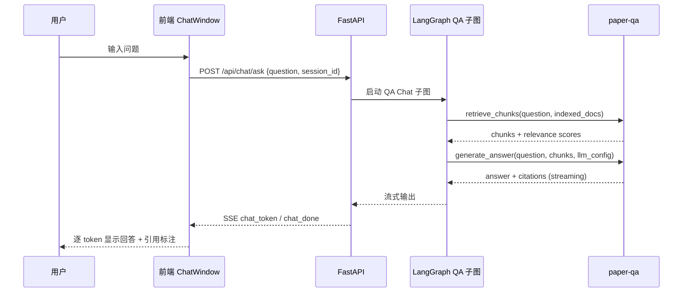

### 8.3 文档索引流程

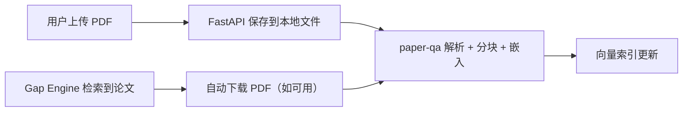

两种文档来源：
- **手动上传**: 用户通过 `DocUploader` 组件上传 PDF → `POST /api/chat/docs/upload`
- **Gap Engine 联动**: Gap Engine 检索到的论文如有 PDF 链接，自动下载并索引（用户可选）

### 8.4 与 Gap Engine 的关系

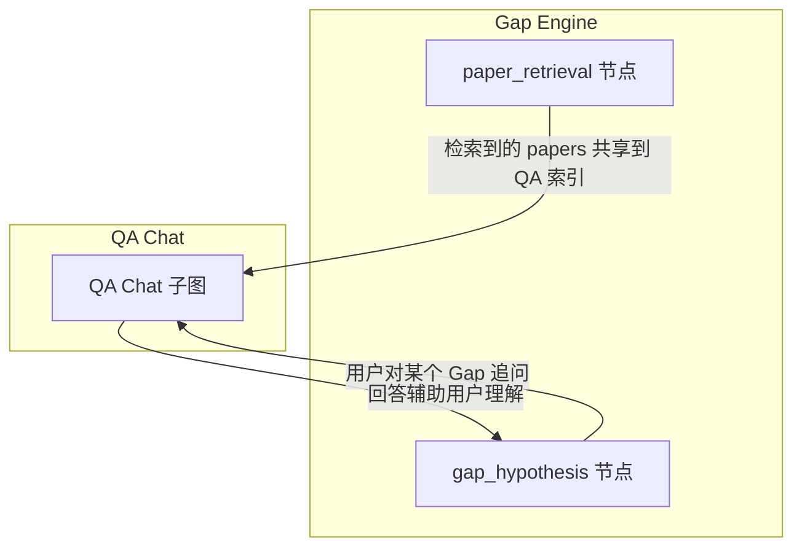

交互模式：
- Gap Engine 运行完成后，检索到的论文自动可用于 QA Chat
- 用户在 Gap 结果页可点击"追问"按钮，跳转到 QA Chat 并预填上下文
- QA Chat 的回答不回写到 Gap Engine State（V0 保持单向）

---

## 9. Artifact Schemas

> 以下 Schema 与 `03_gap_engine.md` 中的定义对齐，V0 新增 `LLMConfig` 和 `Session`。

### 9.1 PaperRecord

```json
{
  "paper_id": "paper-001",
  "title": "Robust EEG Artifact Removal via Multi-Branch Denoising",
  "authors": [
    {"name": "Alice Zhang", "affiliation": "MIT"}
  ],
  "abstract": "...",
  "year": 2024,
  "venue": "NeurIPS",
  "doi": "10.xxxx/xxxxx",
  "external_ids": {
    "arxiv_id": "2401.12345",
    "s2_id": "abc123",
    "openreview_id": "xxxxxx",
    "openalex_id": "W1234567890"
  },
  "pdf_url": "https://arxiv.org/pdf/2401.12345",
  "source": "arxiv",
  "keywords": ["EEG", "artifact removal", "denoising"],
  "citation_count": 42,
  "retrieved_at": "2026-03-15T10:00:00Z"
}
```

### 9.2 GapItem

与 `03_gap_engine.md` 一致：

```json
{
  "gap_id": "gap-001",
  "title": "Lack of robust evaluation for mobile EEG artifact removal",
  "summary": "Current methods are only evaluated in controlled lab settings...",
  "gap_type": ["dataset", "evaluation", "deployment_setting"],
  "evidence_refs": ["paper-001", "paper-013"],
  "confidence": 0.77,
  "scores": {
    "novelty": 0.68,
    "feasibility": 0.74,
    "impact": 0.83
  },
  "session_id": "sess-001",
  "created_at": "2026-03-15T10:05:00Z"
}
```

### 9.3 TopicCandidate

与 `03_gap_engine.md` 一致：

```json
{
  "candidate_id": "cand-001",
  "title": "EEG artifact removal under ambulatory real-world noise",
  "related_gap_ids": ["gap-001"],
  "recommended_next_step": "run Synthesis Engine",
  "risk_summary": "dataset curation may be hard",
  "session_id": "sess-001",
  "created_at": "2026-03-15T10:06:00Z"
}
```

### 9.4 GapAnalysisResult

Gap Engine 单次运行的完整输出：

```json
{
  "run_id": "grun-001",
  "session_id": "sess-001",
  "topic": "EEG artifact removal in ambulatory settings",
  "status": "completed",
  "papers_count": 47,
  "search_result": {
    "source_statuses": [
      {"source": "arxiv", "status": "ok", "count": 15, "latency_ms": 1200},
      {"source": "s2", "status": "ok", "count": 20, "latency_ms": 800},
      {"source": "openreview", "status": "ok", "count": 7, "latency_ms": 1500},
      {"source": "openalex", "status": "ok", "count": 18, "latency_ms": 600}
    ],
    "is_degraded": false
  },
  "ranked_gaps": ["gap-001", "gap-002", "gap-003"],
  "topic_candidates": ["cand-001", "cand-002"],
  "coverage_matrix_summary": {
    "tasks": 5,
    "methods": 12,
    "datasets": 8,
    "empty_cells_pct": 0.34
  },
  "created_at": "2026-03-15T10:00:00Z",
  "completed_at": "2026-03-15T10:06:30Z"
}
```

### 9.5 LLMConfig

V0 新增，内存态存储：

```json
{
  "provider": "openai",
  "model_name": "gpt-4o",
  "api_key": "sk-...",
  "base_url": null,
  "temperature": 0.7,
  "max_tokens": 4096,
  "embedding_model": "text-embedding-3-small",
  "embedding_api_key": null
}
```

字段说明：

| 字段 | 类型 | 必填 | 默认值 | 说明 |
|------|------|------|--------|------|
| `provider` | enum | 是 | `"openai"` | `openai` / `anthropic` / `local` |
| `model_name` | string | 是 | `"gpt-4o"` | 模型标识 |
| `api_key` | string | 是* | — | *local provider 不需要 |
| `base_url` | string | 否 | `null` | 自定义 endpoint |
| `temperature` | float | 否 | `0.7` | 0-2 |
| `max_tokens` | int | 否 | `4096` | 最大输出 token |
| `embedding_model` | string | 否 | `"text-embedding-3-small"` | paper-qa 嵌入模型 |
| `embedding_api_key` | string | 否 | `null` | 嵌入模型独立 key（为空则复用 api_key） |

### 9.6 Session

```json
{
  "session_id": "sess-001",
  "title": "EEG Artifact Removal Research",
  "status": "active",
  "created_at": "2026-03-15T09:55:00Z",
  "updated_at": "2026-03-15T10:06:30Z",
  "artifact_refs": ["gap-001", "gap-002", "cand-001"],
  "gap_runs": ["grun-001"],
  "chat_message_count": 5,
  "indexed_doc_count": 3
}
```

---

## 10. 各组件可行性分析

### 10.1 paper-qa

| 维度 | 评估 |
|------|------|
| 成熟度 | 开源项目，GitHub 5k+ stars，活跃维护 |
| 核心能力匹配 | PDF 解析 + 向量检索 + 带引用问答，完全覆盖 V0 QA Chat 需求 |
| LLM 兼容性 | 支持 OpenAI / Anthropic / 本地模型，通过 `Settings` 配置切换 |
| 嵌入模型 | 默认 OpenAI embedding，可替换为其他 provider |
| 性能 | 单文档索引 ~5-15s，问答响应 ~3-10s（取决于 LLM） |
| 风险 | API 变动频繁（活跃开发期），需锁定版本；大量文档时内存占用需关注 |
| 结论 | **可行 ✓** — 直接使用，无需自建 RAG 管线 |

### 10.2 LangGraph

| 维度 | 评估 |
|------|------|
| 成熟度 | LangChain 官方项目，v0.2+ 稳定，生产级使用案例多 |
| 核心能力匹配 | 有向图工作流 + 状态管理 + checkpoint + 流式输出，完全覆盖 Gap Engine 需求 |
| Checkpoint | 内置 `SqliteSaver`，与 V0 SQLite 选型一致，零额外依赖 |
| 流式支持 | `astream_events` API 支持节点级流式推送 |
| 子图 | 原生支持子图嵌套，QA Chat 可作为独立子图 |
| 风险 | LangGraph Cloud 与 OSS 版本功能差异需注意；State Schema 变更需迁移 |
| 结论 | **可行 ✓** — V0 核心编排引擎 |

### 10.3 四源论文检索

| 源 | API 可用性 | 认证 | 速率限制 | 可行性 |
|----|-----------|------|----------|--------|
| arXiv | REST API，稳定 | 无需 key | 3 req/s 礼貌限制 | **✓** 成熟稳定 |
| Semantic Scholar | REST API，稳定 | 可选 API key（提升限额） | 100 req/5min（无 key） | **✓** 推荐申请 key |
| OpenAlex | REST API，稳定 | 无需 key（mailto 提升限额） | 10 req/s（polite pool） | **✓** 覆盖面最广 |
| OpenReview | API v2，文档较少 | 无需 key | 无官方限制文档 | **△** 可行但需实测，文档不完善 |

综合结论：**可行 ✓** — 四源中三源高度稳定，OpenReview 需额外适配工作但不阻塞。

### 10.4 FastAPI

| 维度 | 评估 |
|------|------|
| 成熟度 | Python Web 框架标杆，生产级 |
| SSE 支持 | 通过 `sse-starlette` 扩展，成熟方案 |
| 异步支持 | 原生 async/await，与 LangGraph / paper-qa 异步调用兼容 |
| SQLite 集成 | `aiosqlite` 异步驱动，轻量无额外服务 |
| 风险 | 无显著风险 |
| 结论 | **可行 ✓** — 标准选型 |

### 10.5 Next.js + shadcn/ui

| 维度 | 评估 |
|------|------|
| 成熟度 | Next.js 行业标准；shadcn/ui 基于 Radix UI，可访问性好 |
| SSE 消费 | 浏览器原生 `EventSource` API，无额外依赖 |
| 组件覆盖 | shadcn/ui 提供 Table / Card / Dialog / Form / Slider 等，覆盖 V0 所有 UI 需求 |
| 状态管理 | SWR/React Query + Context 足够 V0 复杂度 |
| 风险 | shadcn/ui 是 copy-paste 模式，升级需手动；Next.js App Router 学习曲线 |
| 结论 | **可行 ✓** — 标准选型 |

### 10.6 SQLite

| 维度 | 评估 |
|------|------|
| 适用性 | 单用户本地应用，读多写少，完全适合 |
| 异步驱动 | `aiosqlite` 成熟 |
| LangGraph 集成 | `SqliteSaver` 直接使用同一数据库文件 |
| 数据量预估 | V0 单会话 ~100 papers / ~10 gaps / ~50 chat messages，远低于 SQLite 上限 |
| 迁移路径 | V1+ 如需多用户可迁移到 PostgreSQL，Schema 兼容 |
| 结论 | **可行 ✓** — V0 最优选择 |

### 10.7 LLM 配置（内存态）

| 维度 | 评估 |
|------|------|
| 实现复杂度 | 极低，全局变量 + Pydantic model |
| 安全性 | API key 不落盘，关闭即清除，符合安全最佳实践 |
| 用户体验 | 每次启动需重新配置，V0 可接受 |
| 多模型支持 | OpenAI / Anthropic / 本地模型通过 provider + base_url 覆盖 |
| 结论 | **可行 ✓** — 简单有效 |

---

## 11. 风险分析与缓解

### 11.1 技术风险

| # | 风险 | 概率 | 影响 | 缓解措施 |
|---|------|------|------|----------|
| T1 | paper-qa API 不稳定（活跃开发期，接口变动） | 中 | 高 | 锁定版本（`paper-qa==5.x.x`）；封装 adapter 层隔离变更；CI 中加集成测试 |
| T2 | OpenReview API 文档不完善，行为不可预测 | 中 | 低 | OpenReview 作为四源之一，降级不影响核心流程；优先实现其余三源 |
| T3 | LLM API 不可用或响应慢（第三方服务依赖） | 中 | 高 | 内存态配置支持快速切换 provider；超时 + 重试策略；前端明确提示 LLM 状态 |
| T4 | 大量论文索引时 paper-qa 内存溢出 | 低 | 中 | V0 限制单会话索引文档数（≤50）；监控内存使用；分批索引 |
| T5 | LangGraph State Schema 变更导致 checkpoint 不兼容 | 低 | 中 | V0 阶段 checkpoint 仅用于运行恢复，不做跨版本迁移；版本升级时清理旧 checkpoint |
| T6 | 四源并行检索总延迟过高（最慢源拖慢整体） | 中 | 中 | `asyncio.gather` 设置 per-source timeout（10s）；超时源标记 degraded 不阻塞 |

### 11.2 产品风险

| # | 风险 | 概率 | 影响 | 缓解措施 |
|---|------|------|------|----------|
| P1 | Gap 质量不满足用户预期（LLM 生成的 Gap 过于泛泛） | 中 | 高 | Gap Critic 节点过滤低质量 Gap；评分阈值可调；用户可手动 drop/revise |
| P2 | QA Chat 引用不准确（幻觉引用） | 中 | 高 | 依赖 paper-qa 内置引用绑定机制；前端展示引用原文供用户验证；标注 confidence |
| P3 | 用户不理解 Coverage Matrix 含义 | 低 | 低 | 前端提供 tooltip 说明；V0 可简化为表格展示而非复杂可视化 |
| P4 | 每次启动需重新配置 LLM（内存态） | 高 | 低 | V0 已知限制，文档说明；V1 可加可选的本地加密存储 |

### 11.3 工程风险

| # | 风险 | 概率 | 影响 | 缓解措施 |
|---|------|------|------|----------|
| E1 | 前后端联调 SSE 流式协议不一致 | 中 | 中 | 先定义 SSE 事件 Schema（见 6.4）；前后端共享类型定义；集成测试覆盖 |
| E2 | Python / Node 双栈开发维护成本 | 中 | 中 | 明确职责边界：Python 负责 AI/检索/工作流，Node 仅负责 UI；API 契约先行 |
| E3 | SQLite 并发写入冲突（Gap Engine + QA Chat 同时写） | 低 | 中 | 使用 WAL 模式；写操作通过单一 async 连接池序列化 |
| E4 | 依赖版本冲突（paper-qa / LangGraph / LangChain 依赖链复杂） | 中 | 中 | 使用 `uv` 或 `poetry` 锁定依赖；CI 中验证依赖解析；隔离虚拟环境 |

---

## 12. 实施阶段

### 12.1 Phase 0 — QA Chat（基础设施 + 问答能力）

**目标**: 端到端跑通 前端 → FastAPI → paper-qa → 流式回答，验证技术栈可行性。

```mermaid
gantt
    title Phase 0 — QA Chat
    dateFormat  X
    axisFormat %s

    section 后端基础
    FastAPI 项目骨架 + SQLite 初始化       :p0_1, 0, 2
    LLM 配置 API（内存态）                  :p0_2, 0, 1
    会话管理 API                            :p0_3, after p0_1, 2

    section paper-qa 集成
    paper-qa 封装 + LLM 配置透传            :p0_4, after p0_2, 3
    PDF 上传 + 索引 API                     :p0_5, after p0_4, 2
    QA 问答 API + SSE 流式                  :p0_6, after p0_5, 2

    section 前端
    Next.js 项目骨架 + shadcn/ui 配置       :p0_7, 0, 2
    LLM 配置页                              :p0_8, after p0_7, 2
    Chat 页面 + 流式消息                     :p0_9, after p0_8, 3
    PDF 上传组件                             :p0_10, after p0_9, 1

    section 联调
    前后端联调 + SSE 调试                    :p0_11, after p0_6, 2
```

Phase 0 交付物：
- 可运行的 QA Chat：上传 PDF → 提问 → 流式带引用回答
- LLM 配置页：切换 provider/model 即时生效
- 会话管理：创建/列出/删除会话

### 12.2 Phase 1 — Gap Engine（核心工作流）

**目标**: 在 Phase 0 基础上实现完整 Gap Engine 流水线。

**前置依赖**: Phase 0 的 FastAPI 骨架、SQLite、LLM 配置、paper-qa 集成。

```mermaid
gantt
    title Phase 1 — Gap Engine
    dateFormat  X
    axisFormat %s

    section 论文检索层
    BaseAdapter 接口 + ArxivAdapter          :p1_1, 0, 2
    SemanticScholarAdapter                   :p1_2, 0, 2
    OpenAlexAdapter                          :p1_3, 0, 2
    OpenReviewAdapter                        :p1_4, after p1_1, 2
    PaperRetriever 统一层（并行 + 去重 + 降级）:p1_5, after p1_4, 2

    section LangGraph 工作流
    GapEngineState + 图定义                  :p1_6, after p1_5, 2
    topic_intake + query_expansion 节点      :p1_7, after p1_6, 2
    paper_retrieval + normalize_dedup 节点   :p1_8, after p1_7, 2
    coverage_matrix 节点                     :p1_9, after p1_8, 2
    gap_hypothesis + gap_critic 节点         :p1_10, after p1_9, 3
    ranking_packaging 节点                   :p1_11, after p1_10, 1
    Checkpoint (SqliteSaver)                 :p1_12, after p1_6, 1

    section API + 前端
    Gap Engine API endpoints                 :p1_13, after p1_11, 2
    SSE 进度推送                             :p1_14, after p1_13, 2
    Gap Engine 前端页面                      :p1_15, after p1_14, 3
    Gap → QA Chat 联动                       :p1_16, after p1_15, 2

    section 集成测试
    端到端测试                               :p1_17, after p1_16, 2
```

Phase 1 交付物：
- 完整 Gap Engine：输入 topic → 输出 ranked GapItem[] + TopicCandidate[]
- 四源并行检索 + 降级
- 前端进度可视化 + 结果展示
- Gap → QA Chat 追问联动

### 12.3 依赖关系

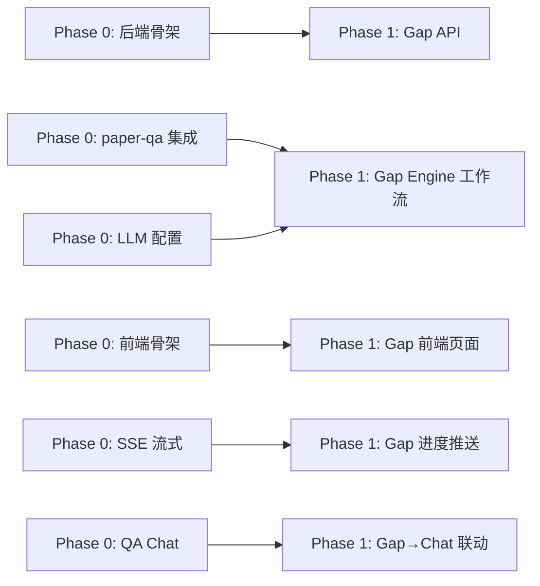

关键路径：`后端骨架 → paper-qa 集成 → LangGraph 工作流 → Gap API → 前端页面 → 联调`

---

## 13. 技术依赖分析

### 13.1 Python 依赖

| 包 | 版本要求 | 用途 | 备注 |
|----|----------|------|------|
| `python` | `>=3.11, <3.13` | 运行时 | 3.11+ 为 LangGraph 最低要求；3.13 尚未被所有依赖支持 |
| `fastapi` | `>=0.115` | Web 框架 | 稳定版 |
| `uvicorn` | `>=0.32` | ASGI 服务器 | FastAPI 标配 |
| `sse-starlette` | `>=2.1` | SSE 支持 | FastAPI SSE 扩展 |
| `langgraph` | `>=0.2, <0.3` | 工作流编排 | 锁定 0.2.x，避免 breaking change |
| `langgraph-checkpoint-sqlite` | `>=2.0` | Checkpoint 持久化 | 与 langgraph 版本对齐 |
| `langchain-core` | `>=0.3` | LangGraph 依赖 | 间接依赖，需锁定兼容版本 |
| `langchain-openai` | `>=0.2` | OpenAI LLM 调用 | 可选，按 provider 安装 |
| `langchain-anthropic` | `>=0.3` | Anthropic LLM 调用 | 可选，按 provider 安装 |
| `paper-qa` | `>=5.0, <6.0` | PDF 解析 + RAG 问答 | 锁定大版本，API 变动频繁 |
| `aiosqlite` | `>=0.20` | SQLite 异步驱动 | 轻量 |
| `httpx` | `>=0.27` | 异步 HTTP 客户端 | 四源检索用 |
| `pydantic` | `>=2.7` | 数据校验 / Schema | FastAPI + LangGraph 共用 |
| `arxiv` | `>=2.1` | arXiv API 客户端 | 官方 Python 包 |
| `Levenshtein` | `>=0.25` | 字符串模糊匹配 | 论文去重用 |

### 13.2 Node.js 依赖

| 包 | 版本要求 | 用途 | 备注 |
|----|----------|------|------|
| `node` | `>=20 LTS` | 运行时 | Next.js 最低要求 |
| `next` | `>=14.2` | React 全栈框架 | App Router |
| `react` / `react-dom` | `>=18.3` | UI 库 | Next.js 依赖 |
| `tailwindcss` | `>=3.4` | CSS 框架 | shadcn/ui 依赖 |
| `@radix-ui/*` | 最新 | 无障碍 UI 原语 | shadcn/ui 底层 |
| `class-variance-authority` | `>=0.7` | 组件变体管理 | shadcn/ui 依赖 |
| `clsx` + `tailwind-merge` | 最新 | 类名合并 | shadcn/ui 工具 |
| `swr` 或 `@tanstack/react-query` | 最新 | 数据获取 | 服务端状态管理 |
| `lucide-react` | 最新 | 图标库 | shadcn/ui 默认图标 |
| `typescript` | `>=5.5` | 类型系统 | 开发依赖 |

### 13.3 兼容性矩阵

```
                    Python 3.11   Python 3.12   Node 20 LTS   Node 22 LTS
FastAPI >=0.115        ✓             ✓             -              -
LangGraph 0.2.x        ✓             ✓             -              -
paper-qa 5.x           ✓             ✓             -              -
aiosqlite >=0.20       ✓             ✓             -              -
Next.js >=14.2         -             -             ✓              ✓
shadcn/ui (latest)     -             -             ✓              ✓
```

推荐开发环境：**Python 3.12 + Node 20 LTS**

### 13.4 依赖冲突风险点

| 冲突点 | 说明 | 缓解 |
|--------|------|------|
| `paper-qa` ↔ `langchain-core` | paper-qa 可能锁定特定 langchain 版本范围 | 安装时先装 paper-qa，再装 langgraph，用 `uv pip compile` 验证解析 |
| `pydantic` v2 | 所有依赖均需 pydantic v2，不可混用 v1 | 确认无 v1-only 依赖 |
| `httpx` 版本 | paper-qa 和 langchain 可能依赖不同 httpx 版本范围 | 锁定兼容交集版本 |

### 13.5 推荐工具链

| 工具 | 用途 |
|------|------|
| `uv` | Python 包管理（替代 pip/poetry，更快的依赖解析） |
| `pnpm` | Node.js 包管理（磁盘效率高） |
| `ruff` | Python lint + format |
| `eslint` + `prettier` | TypeScript lint + format |
| `pytest` + `pytest-asyncio` | Python 测试 |
| `vitest` | 前端测试 |

---

> **文档结束** — 本文档覆盖 Maelstrom V0 MVP（Gap Engine + QA Chat）的完整需求分析与可行性分析。后续实施应以 Phase 0 (QA Chat) 为起点，验证技术栈后推进 Phase 1 (Gap Engine)。
