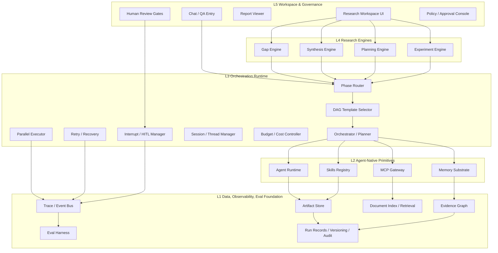

# System Overview

## 1. System Positioning

本系统不是“一个会聊天的科研问答 Agent”，而是一个覆盖科研生命周期的 **phase-driven research workflow system**。  
系统目标是把研究人员从“想题目、读文献、做可行性论证、设计实验、记录实验、归纳结论”这条长链路中大量重复、结构化、可回放的环节抽象出来，并将高不确定性的步骤交给 Agent 推理，将稳定、规则清晰的步骤交给 DAG / skills / programmatic pipelines。

系统采用 **双轴架构**：

- **横轴：Research Engines**
  - Gap Engine
  - Synthesis Engine
  - Planning Engine
  - Experiment Engine
- **纵轴：Platform Layers**
  - Workspace & Governance
  - Orchestration Runtime
  - Agent-Native Primitives
  - Data / Observability / Eval Foundation

---

## 2. Goals

### 2.1 Business Goals

1. 在开题前支持研究人员快速发现候选方向、识别研究缺口并形成可行性论证。
2. 在开题后自动生成实验设计草案、baseline 矩阵、指标与消融方案。
3. 在实验过程中结构化记录运行、失败原因、图表、结论候选与反思。
4. 通过 Evidence Graph、Trace、Eval 与 HITL 机制提高可信性、可审计性与可复现性。

### 2.2 Engineering Goals

1. 保持 **workflow-first, agent-where-needed** 的工程边界。
2. 统一 `agent + memory + skills + MCP` 作为平台原语，而不是把它们误当业务层。
3. 统一 typed artifacts、trace schema、approval points、eval schema。
4. 尽量复用成熟开源框架，不重复造轮子。

---

## 3. Non-Goals

1. 不把系统做成“完全自治科研代理人”，不追求端到端无人监管。
2. 不在第一阶段做复杂 group-chat 风格的 agent 社会。
3. 不自己实现完整底层 LLM serving、向量数据库、浏览器自动化、实验跟踪系统，优先复用现有框架。
4. 不以“纯 QA”为中心；QA 只是入口与交互模式之一。

---

## 4. End-to-End User Journey

### Phase A: Ideation
- 输入主题、研究方向或宽泛问题。
- 系统运行 Gap Engine：
  - 检索综述和相关论文
  - 分析 task / method / dataset / metric 覆盖情况
  - 生成 `GapItem[]` 和 `TopicCandidate[]`

### Phase B: Grounding
- 用户选择候选 Gap / 方向。
- 系统运行 Synthesis Engine：
  - 精确检索
  - 提取 claim / method / limitation
  - 做结论对齐与冲突分析
  - 输出 `ReviewReport` 与 `FeasibilityMemo`

### Phase C: Planning
- 用户确认课题与核心假设。
- 系统运行 Planning Engine：
  - 生成 baseline matrix
  - 设计 metrics / ablations / risks
  - 输出 `ExperimentPlan` 与 `ExecutionChecklist`

### Phase D: Execution & Inference
- 用户执行实验或导入实验记录。
- 系统运行 Experiment Engine：
  - 记录 config / code / data / metrics / plots / failures
  - 推导 `Conclusion[]`
  - 写回 `EvidenceGraph`
  - 输出复盘结论与反思

---

## 5. 2D Layered Architecture



---

## 6. Major Modules and Responsibilities

| Layer | Module | Main Responsibility | Communication |
|---|---|---|---|
| L5 | Workspace UI | 任务发起、报告查看、轨迹回放、人工审批 | 调用 API / session，接收 artifacts、trace 和 approval requests |
| L4 | Gap Engine | 发现研究缺口与候选课题 | 输入 topic，输出 `GapItem[]`, `TopicCandidate[]`, `GapReport` |
| L4 | Synthesis Engine | 文献综述、结论对齐、可行性论证 | 输入 `GapItem` / topic，输出 `ReviewReport`, `Claim[]`, `Evidence[]` |
| L4 | Planning Engine | 实验设计与计划生成 | 输入 `ReviewReport` / `Hypothesis`，输出 `ExperimentPlan`, `BaselineMatrix` |
| L4 | Experiment Engine | 实验记录、结果推导、结论与复盘 | 输入 `ExperimentPlan` + run records，输出 `Conclusion[]`, `ReflectionNote` |
| L3 | Phase Router | 根据阶段和 artifact 类型路由到 engine | 输入 session state / artifacts，输出 selected engine / template |
| L3 | DAG Template Selector | 为 engine 选定流程模板 | 输入 engine type + mode，输出 subgraph template |
| L3 | Orchestrator | 在单个 subgraph 内调用 skills / agents / tools | 输入 current state，输出 next node / actions |
| L2 | Agent Runtime | 执行高不确定节点推理 | 接收 structured state、emit artifacts |
| L2 | Memory Substrate | 保存 working/project/run/evidence memory | 提供 memory views / retrieval |
| L2 | Skills Registry | 挂载复用 procedure bundles | 输入 typed artifacts，输出 typed artifacts |
| L2 | MCP Gateway | 标准化接入外部 tools/resources/prompts | 转换外部调用为 internal tool/resource API |
| L1 | Artifact Store | 持久化中间工件 | CRUD by artifact schema |
| L1 | Evidence Graph | 维护 claim-evidence-plan-run-conclusion 图 | graph read/write |
| L1 | Trace/Event Bus | 记录所有运行事件 | append-only event stream |
| L1 | Eval Harness | 质量评测、回放与回归 | 读取 traces + artifacts，输出 metrics |

---

## 7. Typed Artifact Contract

建议优先定义以下 artifacts：

- `TopicCandidate`
- `GapItem`
- `PaperRecord`
- `Claim`
- `Evidence`
- `ReviewReport`
- `Hypothesis`
- `ExperimentPlan`
- `BaselineMatrix`
- `AblationPlan`
- `RunRecord`
- `Conclusion`
- `ReflectionNote`

### Communication Rule

- **模块之间不直接传大段自然语言**
- 优先传递 **typed artifacts + lightweight summaries**
- 长文由 `Artifact Store` 保存，消息内传 `artifact_id` 与摘要
- Agent 读写的主要对象是 `state + references`，不是全量历史消息

---

## 8. Communication Model

### 8.1 Synchronous Control Path
适用于：
- 子图运行
- 单节点技能调用
- 批准前检查
- 即时问答

### 8.2 Asynchronous Event Path
适用于：
- trace append
- experiment results ingestion
- metrics update
- offline eval
- report rendering queue

### 8.3 Recommended Message Schema

```json
{
  "message_id": "uuid",
  "session_id": "string",
  "phase": "ideation|grounding|planning|execution",
  "source_module": "gap_engine",
  "target_module": "artifact_store",
  "payload_type": "GapItem[]",
  "payload_ref": ["artifact://gap/123"],
  "summary": "Top-3 candidate gaps generated",
  "trace_id": "trace-001"
}
```

---

## 9. Pipeline Composition Overview

### 9.1 Gap Discovery Pipeline
`topic → retrieval → clustering → gap hypothesis → scoring → ranking → review`

### 9.2 Literature Synthesis Pipeline
`gap/topic → retrieval → extraction → citation binding → contradiction analysis → review report`

### 9.3 Experiment Planning Pipeline
`review report → hypothesis framing → baseline/metric/ablation/risk design → validation → plan`

### 9.4 Experiment Inference Pipeline
`run capture → result ingestion → conclusion candidates → critique → reflection → memory writeback`

---

## 10. Where to Use Agent vs Workflow

### Use Agent When
- 需要多视角判断和策略搜索
- 需要根据中间证据动态调整下一步
- 需要生成候选假设、批判、反思
- 需要对冲突信息进行分析归纳

### Prefer Workflow / Skills When
- PDF 解析、元数据归一化、去重、聚类、schema 填充
- baseline matrix 格式化
- citation span binding
- run record capture
- version / provenance binding
- report rendering

---

## 11. Reuse-First Principle

优先复用以下成熟能力，而不是重复造轮子：

| Capability | Reuse Candidate | Why |
|---|---|---|
| Stateful DAG / subgraphs / checkpoints | LangGraph | 对 workflow-first + stateful checkpoints + HITL 很合适 |
| Agent tracing / handoffs / guardrails | OpenAI Agents SDK | 原生 tracing 粒度清晰，适合强 observability |
| Multi-agent team experiments / literature review examples | AutoGen | 有团队与 literature review 示例，可做对照实验 |
| Flow-style business automation | CrewAI Flows | 适合轻量 structured flows |
| External tools/resources/prompts protocol | MCP | 已是事实标准，避免自定义工具协议 |
| SOP-heavy role-play framework | MetaGPT (selectively) | 只借鉴 SOP 思路，不建议做主 runtime |

---

## 12. File Map

后续详细设计见：

- `02_workspace_governance.md`
- `03_gap_engine.md`
- `04_synthesis_engine.md`
- `05_planning_engine.md`
- `06_experiment_engine.md`
- `07_orchestration_runtime.md`
- `08_agent_memory_skills_mcp.md`
- `09_data_observability_eval.md`
- `10_open_source_comparison.md`

---

## 13. References

- LangGraph Docs
- OpenAI Agents SDK Docs
- MCP Specification
- CrewAI Docs
- AutoGen Docs
- MetaGPT GitHub
- OpenHands GitHub
