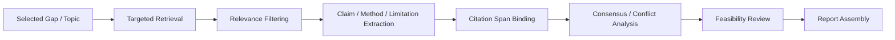

# Synthesis Engine

## 1. Module Definition

Synthesis Engine 负责从候选课题或 gap 出发，完成 **文献综述、结论对齐、冲突分析、可行性论证**。  
它的本质是一个 **structured extraction pipeline with selective agentic critique**，而不是一个完全自由的多 agent 社会。

---

## 2. Core Objectives

1. 精准检索围绕某个 gap / hypothesis 的文献与代码资源。
2. 提取 claim / method / result / limitation / dataset / metric。
3. 绑定 citation spans 与 evidence refs。
4. 找出冲突结论与共识结论。
5. 生成 `ReviewReport` 与 `FeasibilityMemo`。

---

## 3. Inputs / Outputs

### Inputs
- `GapItem` 或 topic
- optional filters（年份、数据源、模态、场景）
- optional existing paper set

### Outputs
- `ReviewReport`
- `Claim[]`
- `Evidence[]`
- `FeasibilityMemo`

---

## 4. Recommended Pipeline



---

## 5. Agent vs Non-Agent Boundary

### Use Agent
- targeted retrieval planning
- contradiction / agreement analysis
- feasibility review
- final synthesis summary

### Do Not Use Agent
- document parsing
- field extraction with fixed schema
- citation span binding
- report template rendering
- bibliography formatting

---

## 6. Internal Submodules

| Submodule | Purpose | Recommended style |
|---|---|---|
| Retrieval Planner | 为 gap 生成高质量检索策略 | Retriever agent |
| Relevance Filter | 去掉噪声文献 | hybrid retrieval + rules |
| Structured Extractor | 提取固定字段 | skill / extraction pipeline |
| Citation Binder | claim 对应 source span | deterministic binder |
| Consensus/Conflict Analyzer | 找共识与矛盾 | critic agent |
| Feasibility Reviewer | 评估是否值得立项 | critic/reviewer agent |
| Report Renderer | 生成综述文档 | workflow renderer |

---

## 7. Artifact Schema Suggestions

### `Claim`
```json
{
  "claim_id": "clm-001",
  "paper_id": "paper-001",
  "claim_type": "method_effectiveness",
  "text": "Method X improves robustness under cross-subject variability.",
  "evidence_refs": ["evi-021"],
  "confidence": 0.81
}
```

### `Evidence`
```json
{
  "evidence_id": "evi-021",
  "source_id": "paper-001",
  "source_span": "page 4, paragraph 2",
  "snippet": "....",
  "modality": "text",
  "provenance": {
    "retrieved_via": "paper_search_profile",
    "timestamp": "..."
  }
}
```

### `ReviewReport`
```json
{
  "report_id": "rev-001",
  "topic": "....",
  "key_claim_ids": ["clm-001", "clm-009"],
  "consensus_points": ["..."],
  "conflict_points": ["..."],
  "open_questions": ["..."],
  "feasibility_summary": "..."
}
```

---

## 8. Skills to Implement

- `claim_extraction_skill`
- `citation_alignment_skill`
- `consensus_conflict_checker`
- `feasibility_summary_skill`
- `review_report_renderer`

---

## 9. Prompt Templates

### 9.1 Claim Extraction Prompt
```text
你是文献结构化抽取器。
给定论文片段，请提取：
- problem
- method
- dataset
- metric
- main result
- limitation
- deployment assumption

约束：
1. 仅依据提供片段
2. 不能凭空补全
3. 输出 JSON
```

### 9.2 Conflict Analysis Prompt
```text
你是 Research Conflict Analyzer。
给定多个 claim 和对应 evidence，请判断：
- 哪些 claim 相互支持
- 哪些 claim 存在直接冲突
- 冲突是否来自数据集、指标、场景、假设差异
- 哪些冲突需要额外实验验证

输出：
{
  "consensus": [...],
  "conflicts": [...],
  "requires_followup": [...]
}
```

### 9.3 Feasibility Review Prompt
```text
你是课题可行性审查员。
请根据综述输出评估：
1. 该方向的真实缺口是否成立
2. 现有工作是否已接近解决
3. 实验资源要求是否合理
4. 该方向是否适合进入 Planning 阶段

输出 verdict: advance / revise / reject
并给出简短理由。
```

---

## 10. Communication with Other Modules

### Upstream
- 接收 `GapItem` / `TopicCandidate`
- 读取 project memory 了解已有证据

### Downstream
- 输出 `ReviewReport` 给 Planning Engine
- 写入 `Claim[]` / `Evidence[]` 到 Artifact Store
- 写入 claim-evidence 关系到 Evidence Graph
- 发送 `review_ready_for_approval` 事件到 Governance 层

---

## 11. Reuse-First Recommendations

- **Parsing / retrieval / graph runtime**：LangGraph + external parsers + MCP
- **Literature-review multi-agent baseline**：AutoGen literature review example 可作为参考，但不建议直接照搬成生产主干
- **Tracing**：如果选 OpenAI stack，可复用 Agents SDK tracing；否则走 OpenTelemetry
