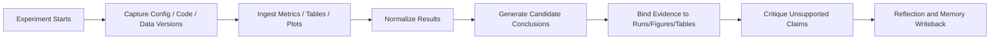

# Experiment Engine

## 1. Module Definition

Experiment Engine 负责研究生命周期后半段：  
**实验记录、运行结果摄取、结果归因、结论候选生成、证据链回写、复盘与反思。**

它不应该被设计成“另一个自由聊天 Agent”，而应被设计成 **run-aware inference runtime**。

---

## 2. Core Objectives

1. 统一记录实验输入（配置、代码版本、数据版本、设备环境）。
2. 摄取 metrics、plots、tables、failure logs。
3. 基于结果生成候选结论，并绑定到 run records / figures / tables。
4. 检查 unsupported claims 与结论跳跃。
5. 生成 ReflectionNote 并写回 project memory。

---

## 3. Inputs / Outputs

### Inputs
- `ExperimentPlan`
- `RunRecord` events / imported logs / metrics / plots
- optional human notes

### Outputs
- `RunRecord[]`
- `Conclusion[]`
- `ReflectionNote`
- updated `EvidenceGraph`

---

## 4. Recommended Pipeline



---

## 5. Agent vs Non-Agent Boundary

### Use Agent
- candidate conclusion generation
- contradiction / anomaly explanation
- reflection summary
- future-next-step recommendation

### Do Not Use Agent
- config capture
- metrics ingestion
- run persistence
- provenance binding
- plot/table indexing
- version recording

---

## 6. Internal Submodules

| Submodule | Purpose | Recommended style |
|---|---|---|
| Run Capture | 记录代码/参数/数据/环境 | deterministic runtime hooks |
| Result Ingestor | 导入 metrics / tables / plots | workflow + adapters |
| Result Normalizer | 统一结果 schema | skill |
| Conclusion Generator | 从结果生成结论候选 | interpreter agent |
| Claim Critic | 检查 unsupported claims | critic agent |
| Reflection Writer | 总结失败与下一步建议 | reflection agent |
| Memory Writer | 写回 project/run memory | workflow |

---

## 7. Artifact Schema Suggestions

### `RunRecord`
```json
{
  "run_id": "run-001",
  "plan_id": "plan-001",
  "config_ref": "cfg-001",
  "code_version": "git:abc123",
  "data_version": "data-v2",
  "metrics": {
    "f1": 0.81,
    "snr_gain": 2.3
  },
  "plot_refs": ["plot-001"],
  "status": "completed"
}
```

### `Conclusion`
```json
{
  "conclusion_id": "cnc-001",
  "statement": "Artifact-aware routing improves robustness on ambulatory noise benchmarks.",
  "supported_by": ["run-001", "plot-001", "tbl-002"],
  "confidence": 0.74,
  "critic_status": "pending"
}
```

### `ReflectionNote`
```json
{
  "note_id": "ref-001",
  "what_worked": ["..."],
  "what_failed": ["..."],
  "suspected_causes": ["..."],
  "next_steps": ["..."]
}
```

---

## 8. Skills to Implement

- `run_capture_skill`
- `result_normalization_skill`
- `result_inference_skill`
- `unsupported_claim_checker`
- `reflection_summarizer`

---

## 9. Prompt Templates

### 9.1 Result Inference Prompt
```text
你是 Result Interpreter。
根据以下 run metrics、plots、tables 和实验计划目标，
生成“候选结论”，要求：
1. 结论必须严格绑定到证据
2. 不能把相关性写成因果性
3. 若证据不足，明确写成“暂不支持结论”

输出 JSON。
```

### 9.2 Unsupported Claim Critic Prompt
```text
你是 Claim Critic。
请检查每条结论是否存在：
- 没有足够 run / figure / table 支撑
- 实际证据只支持局部结论
- 结论遗漏了失败案例或边界条件
- 统计意义或公平比较不足

输出：
{
  "conclusion_id": "...",
  "verdict": "keep|revise|reject",
  "issues": ["..."]
}
```

### 9.3 Reflection Prompt
```text
你是研究复盘助手。
请基于 run records 与失败日志生成：
- what worked
- what failed
- root-cause hypotheses
- recommended next experiments
```

---

## 10. Communication with Other Modules

### Upstream
- 从 Planning Engine 获取 `ExperimentPlan`
- 从 run adapters / external trackers 获取运行数据

### Downstream
- 写 `RunRecord[]` / `Conclusion[]` / `ReflectionNote` 到 Artifact Store
- 向 Evidence Graph 建立 `conclusion_inferred_from_run` 关系
- 向 Memory 写项目经验与失败模式
- 向 Governance 发 `conclusion_ready_for_review`

---

## 11. Reuse-First Recommendations

- 结果与实验追踪：优先适配现有 experiment trackers，不自己实现完整实验平台
- 运行追踪 / observability：优先接 OpenTelemetry / MLflow / W&B / 自己的 run store
- 结论批判：保留轻量 agent，但不要把 run capture 交给 agent
